# Edison Barcode Images

All 24 barcodes extracted from the Edison V3 complete barcode list. Each image includes the barcode and the scan arrow. Source: `Upstream/barcodes/Edison-complete-barcode-list.pdf`.

To use in a session page: ``

---

## Pre-set Barcode Programs

These run without a computer. Scan, then press play.

| Image | Filename | Description |
|-------|----------|-------------|
| 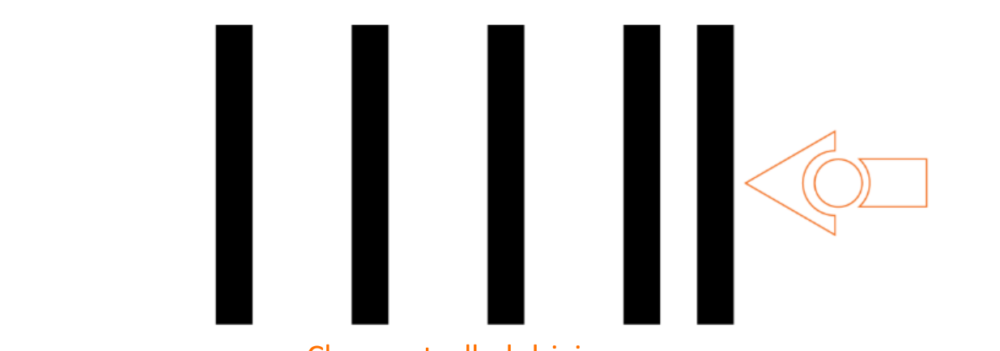 | `clap-controlled-driving.png` | Clap Controlled Driving |
| 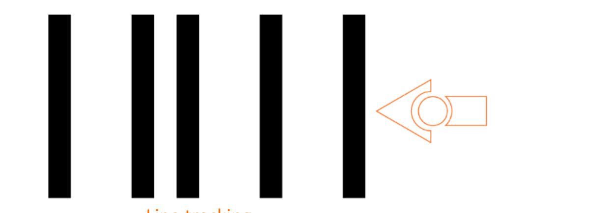 | `line-tracking.png` | Line Tracking |
| 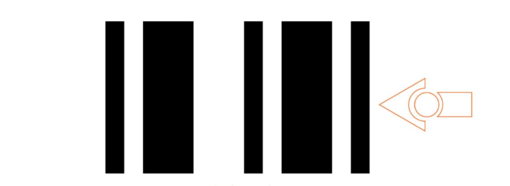 | `avoid-obstacles.png` | Avoid Obstacles |
| 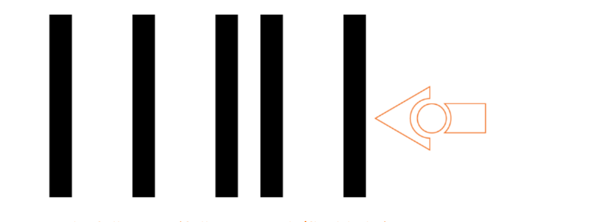 | `light-following.png` | Light Following (torch/flashlight) |
| 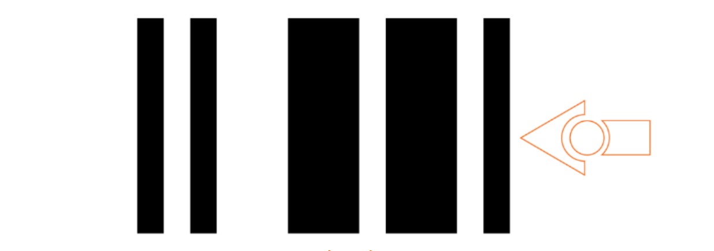 | `bounce-in-borders.png` | Bounce in Borders |
| 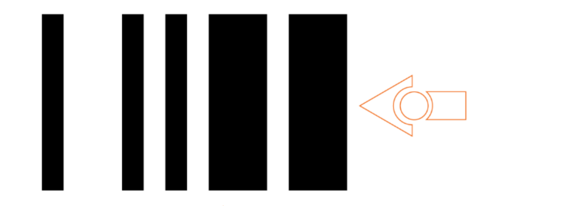 | `sumo-wrestle.png` | Sumo Wrestle |

---

## Remote Control Driving

Scan one of these first to set the Edison remote control mode, then use a TV/DVD remote.

| Image | Filename | Description |
|-------|----------|-------------|
| 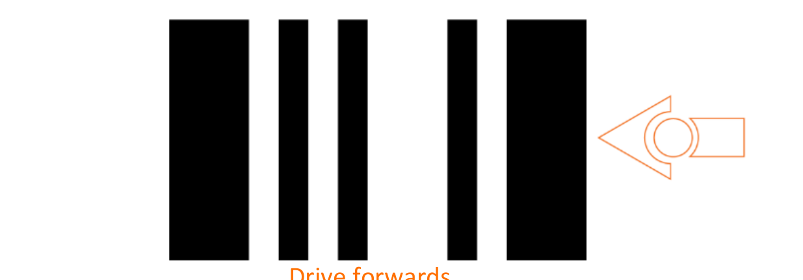 | `remote-drive-forwards.png` | Remote: Drive Forwards |
| 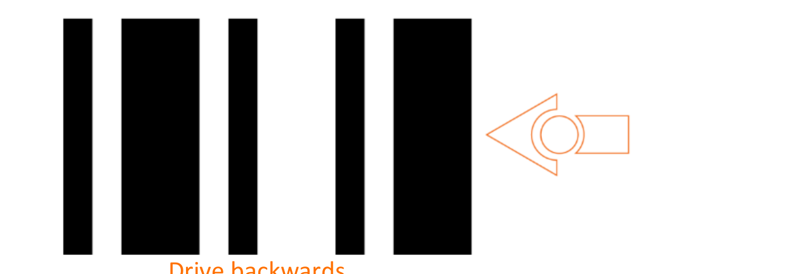 | `remote-drive-backwards.png` | Remote: Drive Backwards |
| 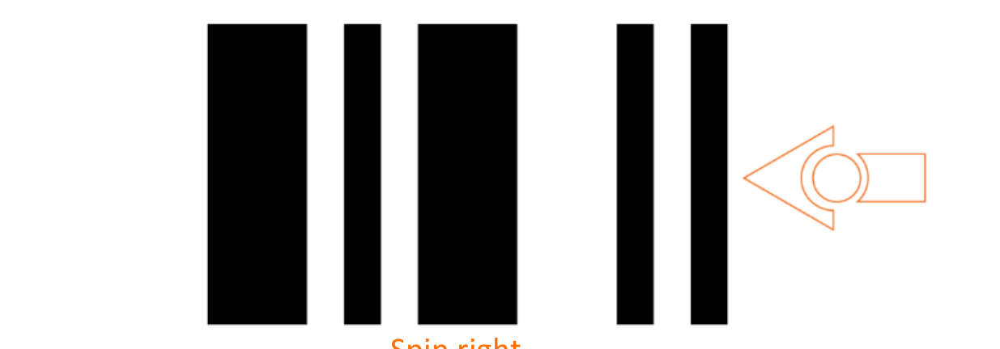 | `remote-spin-right.png` | Remote: Spin Right |
| 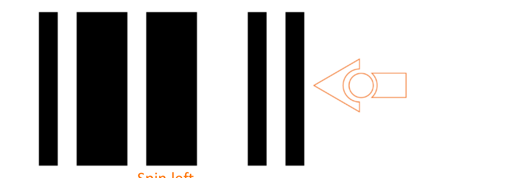 | `remote-spin-left.png` | Remote: Spin Left |
| 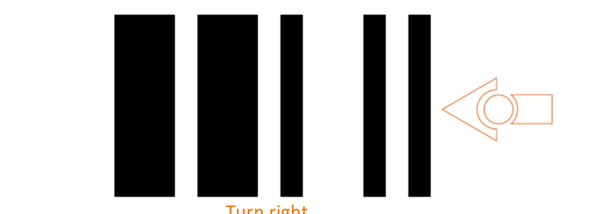 | `remote-turn-right.png` | Remote: Turn Right |
| 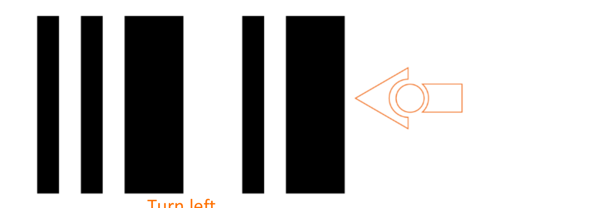 | `remote-turn-left.png` | Remote: Turn Left |
| 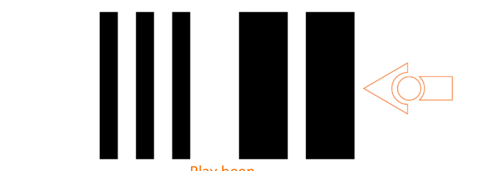 | `remote-play-beep.png` | Remote: Play Beep |
| 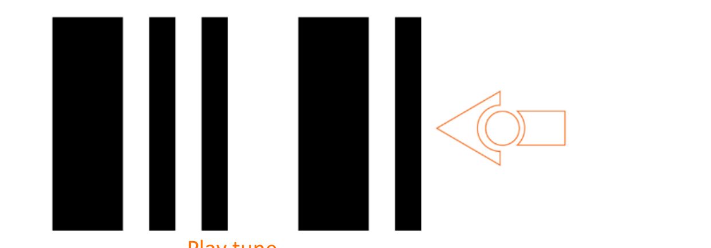 | `remote-play-tune.png` | Remote: Play Tune |

---

## TV/DVD Remote Control — Programmable Codes

Assign these codes in EdBlocks or EdScratch to trigger custom programs via TV remote buttons.

| Image | Filename | Description |
|-------|----------|-------------|
| 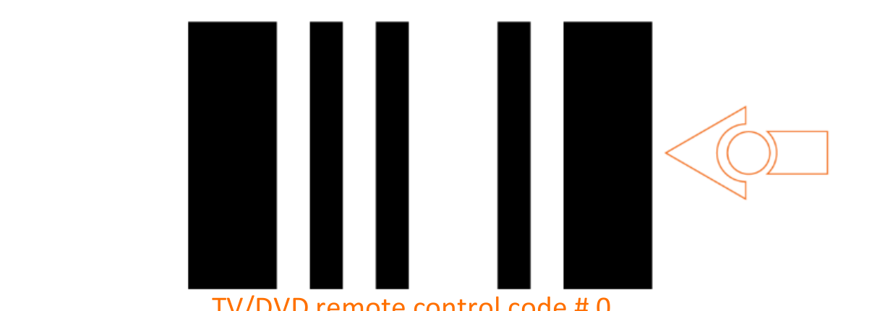 | `tv-remote-code-0.png` | TV/DVD Remote Control Code 0 |
| 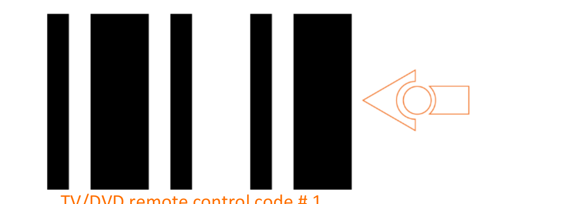 | `tv-remote-code-1.png` | TV/DVD Remote Control Code 1 |
| 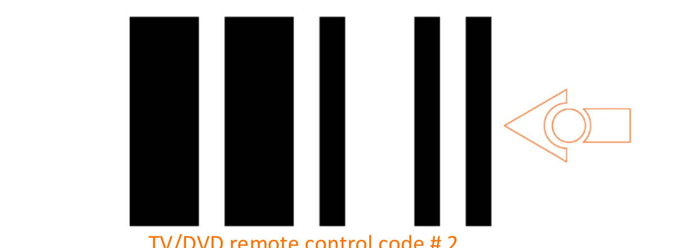 | `tv-remote-code-2.png` | TV/DVD Remote Control Code 2 |
| 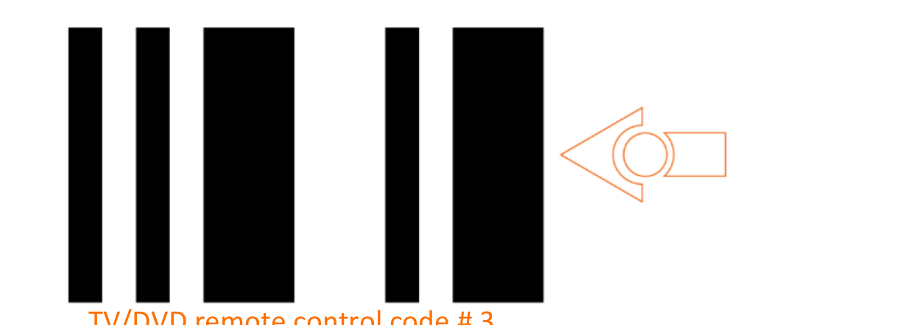 | `tv-remote-code-3.png` | TV/DVD Remote Control Code 3 |
| 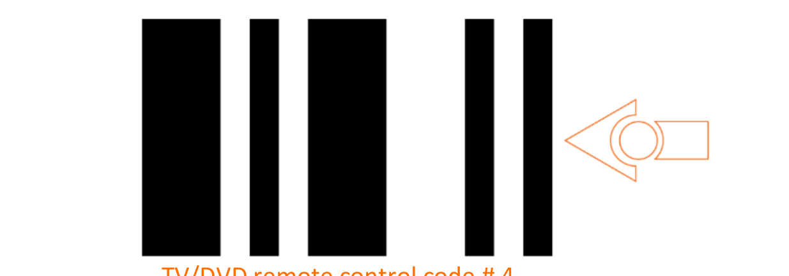 | `tv-remote-code-4.png` | TV/DVD Remote Control Code 4 |
| 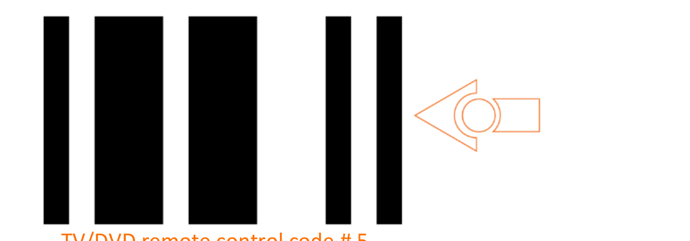 | `tv-remote-code-5.png` | TV/DVD Remote Control Code 5 |
| 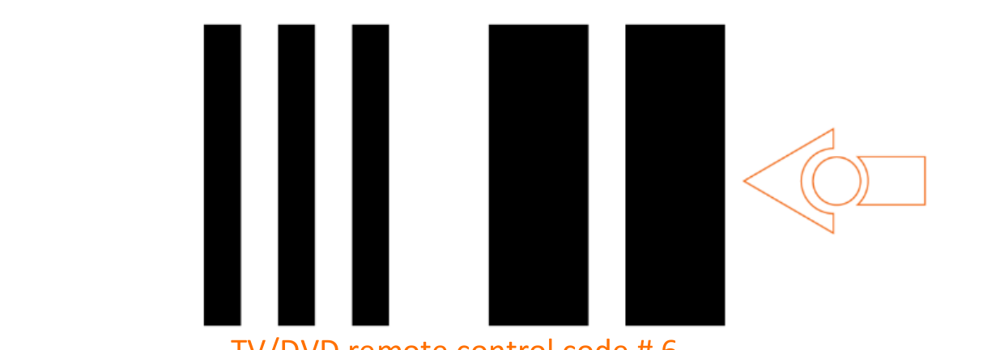 | `tv-remote-code-6.png` | TV/DVD Remote Control Code 6 |
| 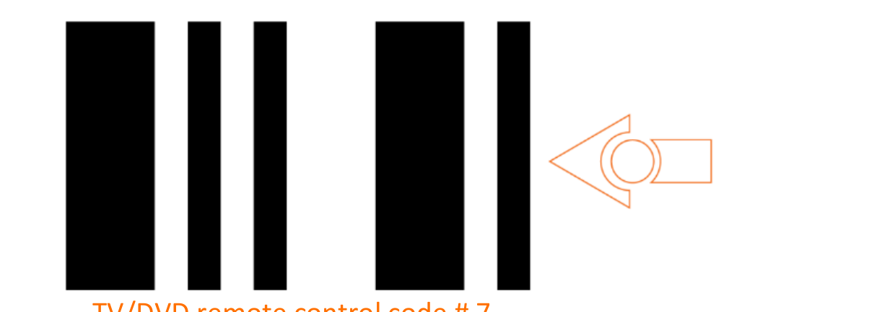 | `tv-remote-code-7.png` | TV/DVD Remote Control Code 7 |

---

## Calibration Barcodes

| Image | Filename | Description |
|-------|----------|-------------|
| 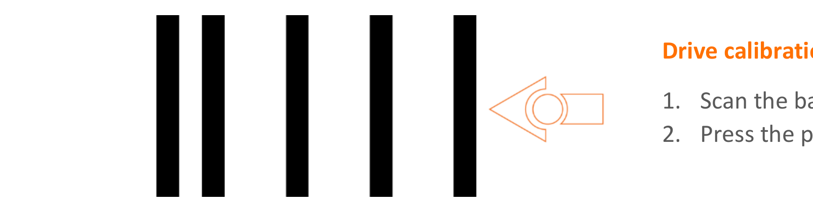 | `calibrate-drive.png` | Drive Calibration (V2 robots only) |
| 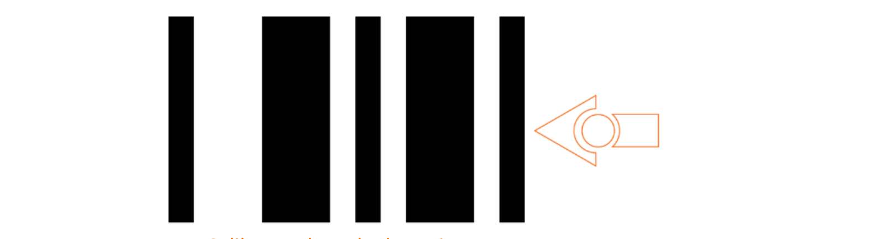 | `calibrate-obstacle.png` | Calibrate Obstacle Detection |
